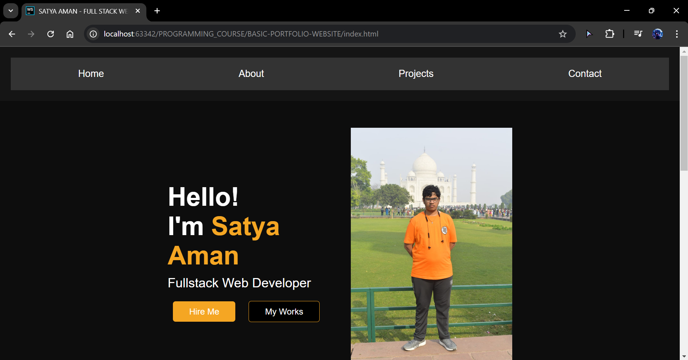
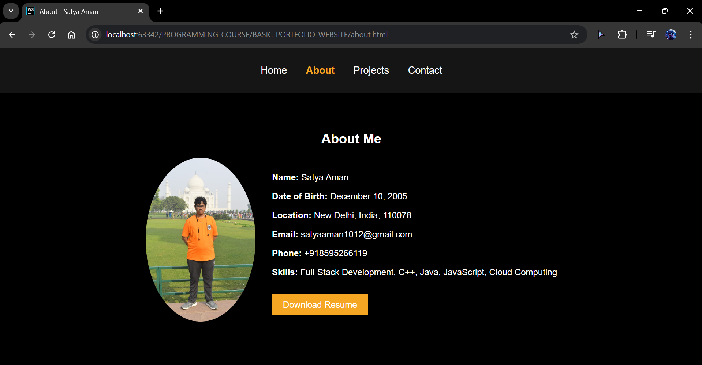
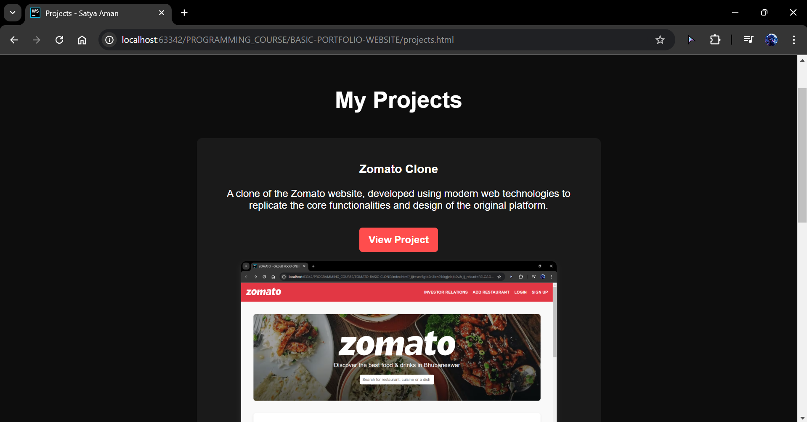
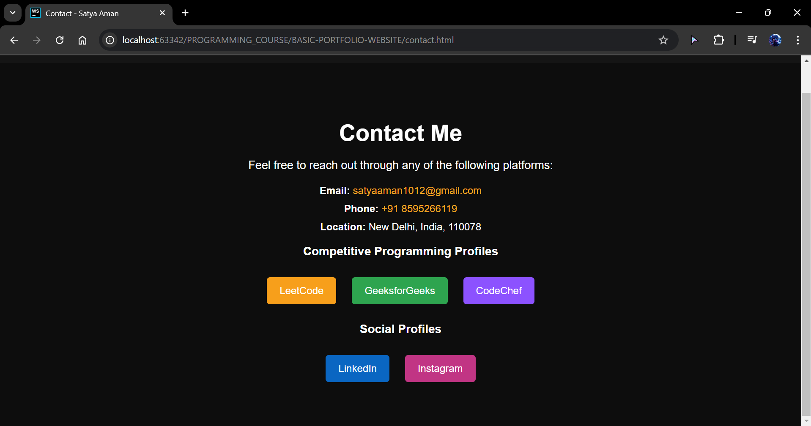

# BASIC PORTFOLIO WEBSITE

A responsive and minimalistic personal portfolio website showcasing skills, projects, and contact information.

## 🚀 Features
- **Responsive Design** – Optimized for mobile and desktop.
- **Modern UI/UX** – Clean and elegant layout.
- **Fast and Lightweight** – Efficiently structured with optimized assets.
- **Contact Form** – Enables direct communication.
- **Social Media Integration** – Links to GitHub, LinkedIn, and other profiles.

## 📁 Repository Structure
```bash
BASIC-PORTFOLIO-WEBSITE/
│── FILES/               # Images and assets
│   ├── ABOUT.png
│   ├── CONTACT.png
│   ├── GFG160.png
│   ├── HOME.png
│   ├── PROJECTS.png
│   ├── profile.png
│   ├── profile2.jpg
│   ├── RESUME
│   ├── ZOMATO1.png
│   ├── ZOMATO2.png
│── about.css            # Styles for about page
│── about.html           # About section
│── contact.css          # Styles for contact page
│── contact.html         # Contact page
│── index.html           # Main homepage
│── project.css          # Styles for projects page
│── projects.html        # Projects showcase
│── README.md            # Project documentation (this file)
│── style.css            # Global styles
```

## 🔧 Installation & Usage
### Clone the Repository
```bash
git clone https://github.com/amansatya/BASIC-PORTFOLIO-WEBSITE.git
cd BASIC-PORTFOLIO-WEBSITE
```

### Open in Browser
Simply open `index.html` in a web browser to view the portfolio.

## 📸 Screenshots

### Home Page


### About Page



### Projects Page


### Contact Page


## 📌 Technologies Used
- **HTML5** – Structuring the content.
- **CSS3** – Styling and responsiveness.

## ✨ Live Demo
[Click here to view](https://amansatya.github.io/BASIC-PORTFOLIO-WEBSITE/)

## 📝 License
This project is licensed under the MIT License.

## 📬 Contact
- **Email:** satyaaman1012@gmail.com
- **LinkedIn:** [Satya Aman](https://www.linkedin.com/in/satya-aman-00938a318/)
- **Instagram:** [Profile](https://www.instagram.com/amansatya_10/)

---
Feel free to contribute and improve this project! 🚀

💡 **Developed by [Aman Satya](https://github.com/amansatya)**
